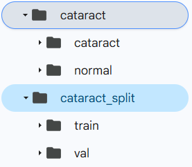
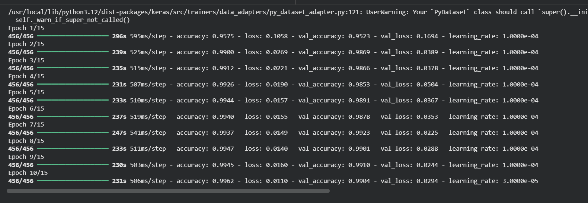
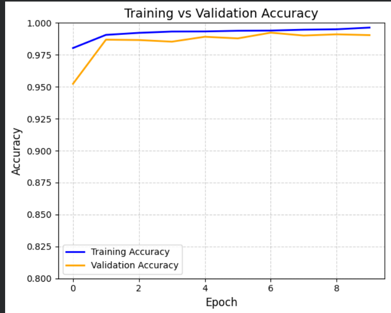
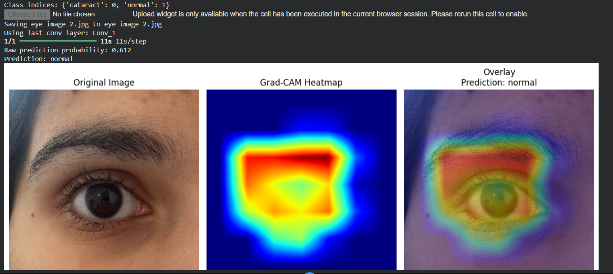

# Cataract Detection 

This project focuses on detecting cataracts from eye images using a deep learning–based image classification approach(transfer learning).  
The model is trained on a large custom dataset and implemented using Google Colab.

## Project Overview
- Loads a custom eye image dataset from Google Drive
- Applies image preprocessing and data augmentation
- Trains a deep learning model to classify images as cataract or non-cataract
- Evaluates the model on validation and test data

## Explainable AI (XAI) – Grad-CAM
To improve model interpretability, Grad-CAM (Gradient-weighted Class Activation Mapping) was used to explain the predictions made by the deep learning model.

- Grad-CAM visualizations highlight the regions of eye images that most influenced the model’s decision
- This helps verify whether the model focuses on clinically relevant areas
- Explainability is especially important for medical image analysis tasks such as cataract detection

## Dataset
- Custom dataset containing approximately **21,000 eye images**
- Stored in Google Drive
- Not included in this repository due to size constraints

### Dataset Structure
Dataset/
├── train/
│ ├── cataract/
│ └── normal/
├── val/
│ ├── cataract/
│ └── normal/
└── test/
├── cataract/
└── normal/

## Technologies Used
- Python
- Google Colab
- TensorFlow / Keras 
- NumPy
- Matplotlib

## How to Run the Project
1. Upload the dataset to your Google Drive
2. Open the notebook in Google Colab
3. Mount Google Drive
4. Update the dataset path in the notebook:/content/drive/MyDrive/YourDatasetFolder
5. Run all cells sequentially

## Results
The model was successfully trained to detect cataracts from eye images and achieved good performance on validation and test datasets.

## Notes
- This project is developed for academic and learning purposes
- The dataset is private and used only for experimentation

## Screenshots

### Dataset Structure

### Training Output

### Results

### Grad-CAM Visualization

